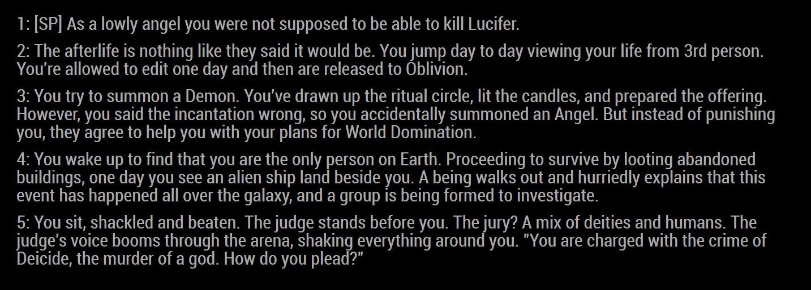

# Reddit Writing Prompts Module

Simple magic mirror module that pulls a set number of posts from r/WritingPrompts. This was written to allow ideally 5 posts but could show more to get your creating brain going. The pull from Reddit automatically filters out any stickied posts.


## Example With 5 Posts


## Configuration

``` javascript
{
    module: "MMM-RedditAww",
    position: "top-left", //position,
    postChangeTime: 60000, // Time the visible post refreshes default is one minute
    postUpdateTime: 1200000 // Time between reloads of pulls, default is 20 mins
},
```